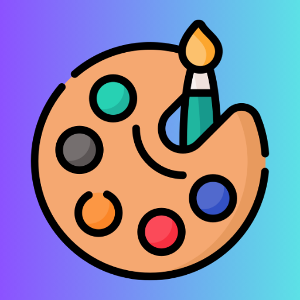
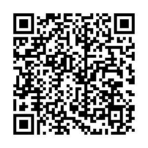
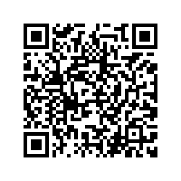
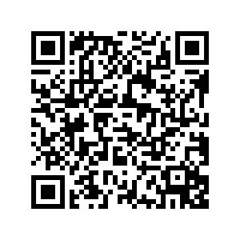
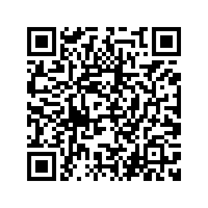

<!-- omit in toc -->
# 🍽️ El Bocado - App de Gestión Gastronómica

**El Bocado** es una aplicación móvil pensada para optimizar y digitalizar los procesos de gestión de un comercio gastronómico. Esta app busca brindar una solución integral, intuitiva y adaptable a las necesidades reales del negocio.

Este repositorio contiene el desarrollo completo de la app, utilizando tecnologías modernas y enfocadas en ofrecer una experiencia fluida tanto para el personal como para los administradores del comercio.

---
<!-- omit in toc -->
## 📚 Índice
- [🧑‍💻 Integrantes del Equipo](#-integrantes-del-equipo)
- [📱 Tecnologías Utilizadas](#-tecnologías-utilizadas)
- [📊 Funcionalidades](#-funcionalidades)
- [📷 Imágenes](#-imágenes)
  - [Icono](#icono)
- [📎 Otros](#-otros)

---

## 🧑‍💻 Integrantes del Equipo

| Nombre          | Perfil de GitHub                                               | Rama de Desarrollo |
| --------------- | -------------------------------------------------------------- | ------------------ |
| Alejo Falcone   | [github.com/AleFalcone27](https://github.com/AleFalcone27)     | `ale-dev`          |
| Agustin Mondani | [github.com/AgustinMondani](https://github.com/AgustinMondani) | `agus-dev`         |
| Ignacio Fachado | [https://github.com/fachado](https://github.com/fachado)       | `ignacio-dev`      |

---

## 📱 Tecnologías Utilizadas

---

📅 Semana 1: 24/05 - 30/05

| Responsable | Tarea               | Fecha de comienzo | Fecha de fin | Estado actual | Scope   |
| ----------- | ------------------- | ----------------- | ------------ | ------------- | ------- |
| Alejo       | Inicializar README  | 29/06/25          | 31/06/25     | Listo 🟢       | General |
| Alejo       | Set up del proyecto | 29/06/25          | 31/06/25     | Listo 🟢       | General |
| Agustin     | Login               | 30/06/25          | 31/06/25     | Listo 🟢       | General |
| Alejo       | Splash              | 30/06/25          | 31/06/25     | Listo 🟢       | General |

---

📅 Semana 2: 31/05 - 06/06

🔁 **Tareas del sprint anterior no completadas:** Todas las tareas fueron completadas a tiempo

| Responsable  | Tarea                                      | Fecha de comienzo | Fecha de fin | Estado actual | Scope      |
| ------------ | ------------------------------------------ | ----------------- | ------------ | ------------- | ---------- |
| Alejo        | Alta nuevo cliente                         | 02/06/25          | 04/06/25     | Listo 🟢       | Cliente    |
| Alejo        | Lista de clientes pendientes de aprobación | 04/06/25          | 05/06/25     | Listo 🟢       | Supervisor |
| Ignacio      | Spinner personalizado                      | 03/06/25          | 07/06/25     | Listo 🟢       | General    |
| Ignacio      | Sistema de alertas                         | 03/06/25          | 07/06/25     | Listo 🟢       | General    |
| Agustin      | Componente volver                          | 06/06/25          | 06/06/25     | Listo 🟢       | General    |
| Agustin      | Componente cerrrar                         | 06/06/25          | 06/06/25     | Listo 🟢       | General    |
| No designado | Sistema de Vibración                       | -                 | -            | Pendiente 🔴   | General    |
| No designado | Registro rapido con QR                     | -                 | -            | Pendiente 🔴   | General    |

---

📅 Semana 3: 07/06 - 13/06

🔁 **Tareas del sprint anterior no completadas:** 
- Sistema de Vibración
- Registro rapido con QR

| Responsable  | Tarea                                                                | Fecha de comienzo | Fecha de fin | Estado actual | Scope            |
| ------------ | -------------------------------------------------------------------- | ----------------- | ------------ | ------------- | ---------------- |
| Alejo        | Alta Maitre                                                          | 7/6/25            | 8/6/25       | Listo 🟢       | Maitre           |
| Alejo        | Creación de lista de espera                                          | 8/6/25            | 9/6/25       | Listo 🟢       | Mozo y Cliente   |
| Ignacio      | Registro rapido con QR                                               | 10/6/25           | 13/6/25      | Listo 🟢       | General          |
| Agustin      | Home Clientes                                                        | 11/6/25           | 12/6/25      | Listo 🟢       | Cliente          |
| Agustin      | Deshabilitar botones de menú y encuestas segun el estado del cliente | 11/6/25           | 12/6/25      | Listo 🟢       | Cliente          |
| Agustin      | Chat Mozos-Cliente                                                   | 11/6/25           | 12/6/25      | Listo 🟢       | Mozo y Cliente   |
| Ignacio      | Fix Spinner                                                 | 11/6/25           | 12/6/25      | Listo 🟢       | General          |
| Ignacio      | Fix Toasts                                                 | -           | -      | Listo 🟢       | General          |
| Ignacio      | Registro rapido con QR                                               | -                 | -            | Pendiente 🔴             | General          |
| Alejo        | Menú                                                                 | -                 | -            | Pendiente 🔴             | Cliente          |
| No designado | QR de ingreso al local:                                              | -                 | -            | Pendiente 🔴             | Cliente y Maitre |
| No designado | QR Mesa:                                                             | -                 | -            | Pendiente 🔴             | Mozo y Cliente   |

---

📅 Semana 4: 14/06 - 20/06

🔁 **Tareas del sprint anterior no completadas:** 
- Registro rapido con QR
- Menú
- QR de ingreso al local:
- QR Mesa

| Responsable | Tarea | Fecha de comienzo | Fecha de fin | Estado actual | Scope |
| ----------- | ----- | ----------------- | ------------ | ------------- | ---------------- |
| Alejo            | Registro rapido con QR       | 16/6/25                 | 17/6/25            | Listo 🟢             | Cliente
| Alejo            | Menú      | 18/6/25                | 19/6/25            | Listo 🟢             | Cliente
| Alejo            | QR de ingreso al local      | 16/6/25                 | 17/6/25            | Listo 🟢             | Cliente
| Agutin          | QR Mesa      | 16/6/25                 | 17/6/25            | Listo 🟢             | Cliente y Mozo
| Agutin          | Chat cliente Mozo      | 16/6/25                 | 19/6/25            | Listo 🟢             | Cliente y Mozo
| Ignacio            | Arreglo de toast      | 16/6/25                 | 17/6/25            | Listo 🟢             | General
| Ignacio            | Arreglo de spinner      | 18/6/25                 | 17/6/25            | Listo 🟢             | General
| No designado          | Realizar pedido     | -               | -           | Pendiente 🔴             | -

---
📅 Semana 5 **PRESENTACION DE LOS REQUERIMIENTOS PARA EL SEGUNDO PARCIAL**: 21/06 - 27/06

🔁 **Tareas del sprint anterior no completadas:** 
| Responsable | Tarea | Fecha de comienzo | Fecha de fin | Estado actual |
| ----------- | ----- | ----------------- | ------------ | ------------- |
|             |       | -                 | -            | -             |
|             |       | -                 | -            | -             |
|             |       | -                 | -            | -             |

---
## 📊 Funcionalidades
- Registro de usuarios
- Alta usuarios desde el perfil de supervisor
- Registro rápido con escaneao de DNI
- Menú disponíble para realizar un pedido
- Lectura de QR's
- Lista de espera
- Asignación de mesas por el maitre
- Chat 
---

## 📷 Imágenes
### Icono

### QR de ingreso al local

### QR Mesa 1

### QR Mesa 2

### QR Mesa 3

---

## 📎 Otros

